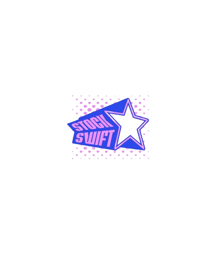

# StockSwift-Sneaker-ApI Documentation

</img>

Sneaker Api created using the Sneaks-Api package.
This api is great for practicing the implementation of backend in your frontend project.

# Installation:

git clone https://github.com/Rafa020/StockSwift-Sneaker-ApI.git
cd StockSwift-Sneaker-ApI
npm install

to start the api:
npm start

helpful video on hwo to use nodejs in a framework such as react:
<a href="https://youtu.be/w3vs4a03y3I?si=R9espNFXuQnO6kod" target="_blank">
Video Link
</a>
 # 1. / (Default path you get no response)
Method: GET
Description: Default route
Function: Responds with no content.

# 2. /Products/Popular
Method: GET
Description: Retrieves popular products.
Query Parameters:
limit: (Required) Specifies the number of products to retrieve.
Functionality:
If limit is valid, it retrieves popular products based on the provided limit.

example api request: /Products/Popular?limit=100
the example above return up to 100 popular streetwear items

# 3. /Products/Search
Method: GET
Description: Searches for products.
Query Parameters:
name: (Required) Specifies the name of the product to search for.
limit: (Required) Specifies the number of products to retrieve.
Functionality:
If inputs are valid, it searches for sneakers based on the provided name and limit.

example api request: /Products/Popular?name=jordan&limit=100
the example above return up to 100 Jordan sneaker items

# 4. /Products/Style
Method: GET
Description: Retrieves product style information.
Query Parameters:
id: (Required) Specifies the style ID of the product.
Functionality:
If id is valid, it retrieves the style information for the specified product.

example api request: /Products/Style?id=MR530SG
the example abovereturns an adidas sneaker with the specified id

Note:
All responses are in JSON format.
Error messages are returned when necessary parameters are missing or invalid.
The server listens on the specified port number for incoming requests.
